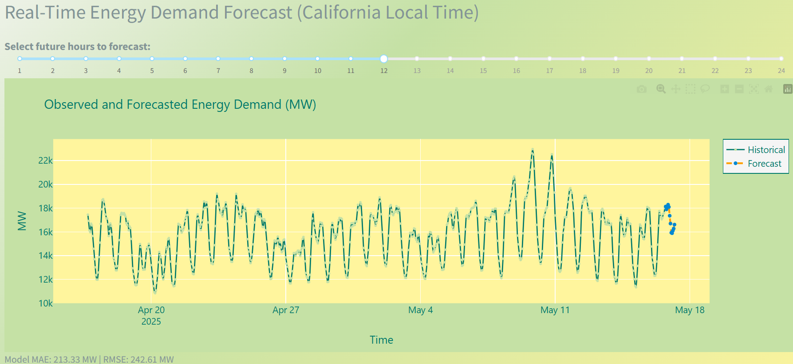

# California Energy Demand Dashboard

[](https://www.python.org/) [](LICENSE)

An interactive dashboard for analyzing and forecasting hourly energy demand in California (CAISO) using real EIA data and advanced machine learning (LightGBM, XGBoost, Stacking). Built with Dash and Plotly, with a modern energy-themed design.

---

## 🚀 Features

- **Live Data**: Fetches real hourly demand data from the EIA API (CAISO)
- **Forecasting**: Real-time, interactive forecast with stacking ensemble (LightGBM + XGBoost )
- **Advanced Analytics**: Distribution, seasonality, variability, and outlier analysis
- **Model Transparency**: Feature importance and model details
- **Local Time**: All times shown in California local time (America/Los_Angeles)
- **Attribution**: Credits and clear documentation

---

## 📸 Screenshots


---

## 🛠️ Installation

1. **Clone the repository:**
   ```bash
   git clone https://github.com/LanderAgirre/energy-demand.git
   ```

2. **Install dependencies:**
   ```bash
   pip install -r requirements.txt
   ```

3. **Set your EIA API Key:**
   - Get a free API key at [EIA Open Data](https://www.eia.gov/opendata/register.php)
   - Edit `app.py` and replace the value of `EIA_API_KEY` with your key.

4. **Run the app:**
   ```bash
   python app.py
   ```

5. **Open your browser:**
   - Go to [http://127.0.0.1:8050](http://127.0.0.1:8050)
---

## 📂 Project Structure

```
energy-demand/
│
├── app.py                # Main Dash app
├── requirements.txt      # Python dependencies
├── README.md             # Project documentation
├── LICENSE               # MIT License
├── .gitignore            # Git ignore file
├── assets/              
    └── custom.css
    └── forecast.png
```
---
## 📊 Dashboard Overview

- **Last Month Data**: Explore recent hourly demand patterns and cycles.
- **Analysis**: Visualize distribution (histogram, violin, strip plot), seasonality, and variability.
- **Model Details**: Feature importance and model summary for transparency.
- **Forecast**: Interactive, real-time forecast for up to 24 hours ahead.
---

## 📄 License
This project is licensed under the MIT License. See the [LICENSE](LICENSE) file for details.
